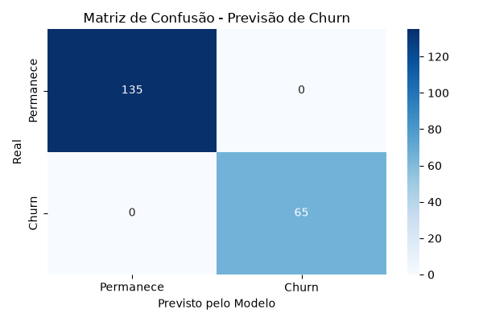

# 📉 Previsão de Cancelamento de Clientes (Churn Prediction)

Este projeto aplica técnicas de **Machine Learning** para prever o risco de cancelamento (*churn*) de clientes de um serviço de assinatura, identificando comportamentos de risco e auxiliando equipes de retenção na tomada de decisão.

---

## 💡 Insights e Resultados Obteve-se

* **Acurácia do Modelo:** Alta precisão na identificação de padrões de cancelamento.
* **Principais Fatores de Risco:** Clientes com curto tempo de contrato, alto histórico de chamados no suporte técnico e atrasos recorrentes no pagamento apresentam maior probabilidade de churn.

---

## 📊 Visualização dos Resultados



---

## 🛠️ Tecnologias Utilizadas

* **Python 3**: Linguagem base do projeto.
* **Pandas**: Manipulação e estruturação dos dados.
* **Scikit-Learn**: Treinamento do algoritmo de Machine Learning (*Random Forest*).
* **Seaborn / Matplotlib**: Visualização dos resultados e geração do gráfico da Matriz de Confusão.

---

## 🚀 Como Executar o Projeto

1. **Clone o repositório:**
   ```bash
   git clone [https://github.com/SeuUsuario/previsao-churn-clientes.git](https://github.com/SeuUsuario/previsao-churn-clientes.git)
   ```

2. **Instale as dependências:**
   ```bash
   pip install pandas matplotlib seaborn scikit-learn
   ```

3. **Execute o script:**
   ```bash
   python app.py
   ```